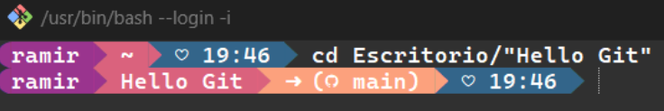

# 💻 Git & Github

# 📝 Guia, descripciones y comandos de Git y Github para el dia a a dia vaya (y en español)

### Archivo con imagenes, comandos y descripciones para realizar un repositorio con git y github, una guia basica y sencilla. 

# 📌 ¿Qué es Git? 
 
Git es un sistema de control de versiones. Pero, ¿Que es un "control de versiones"?
Bueno, este se refiere a un sistema que registra los cambios de un archivo o un conjunto de archivos a lo largo del tiempo con el que tomamos "snapshots o capturas" de un momento determinado y que en el futuro pueden ser utilizadas para regresar a ellas, recuperarlas y trabajar con las mismas. 

# 🔗 Instalacion y configuracion básica de Git

Para descargar e instalar Git entraremos al siguiente [link](https://git-scm.com/downloads)

Ahi podremos seleccionar la descarga para el sistema operativo que vayamos a usar, en mi caso fue para Windows.

Tendremos una aplicacion llamada **Git Bash** y un archivo en nuestra carpeta personal llamada **.gitconfig**, estos seran importantes para seguir con los siguientes pasos.

Ahora realizaremos una configuracion basica local del usuario para todos los respositorios locales con los siguientes comandos: 

**Establece el nombre que estará asociado a tus commits**

`$ git config --global user.name "[nombre]"`

**Establece el e-mail que estará asociado a tus commits**

`$ git config --global user.email "[email]"`

# 📁 Crear un repositorio

Crearemos una carpeta en la ubicacion de nuestra preferencia (Para el ejemplo se creo una llamada "Hello Git"). Una vez hecha, abriremos **Git Bash** y nos moveremos hasta llegar a la carpeta que creamos mediante el comando **cd (Change Directory)**

Aqui utilizaremos el comando  `$ git init` el cual creara una area conocida **staging** (donde se gurdan temportalmente nuestros archivos) y un **repositorio local** (historial del proyecto)

Podremos agregar nuevos archivos a esa carpeta desde la consola con el comando `$ touch "[nombre]"` o utilizar el comando `code .`  con el que se nos abrira Visual Studio Code directamente.

Cuando trabajamos con git, estos archivos pasan por diferentes **estados**. Podemos verificar en que estado se encuentran nuestros archivos con el comando `$ git status`.

 

# 🌱 Ramas o Branches

Todos los commits se aplican sobre una rama principal que por defecto se llama **MASTER**, sin embargo, por cuestiones de buenas practicas se recomienda renombrar esta rama a **MAIN** con el comando `git branch -m main
`

Crear una **rama** consiste en copiar un **commit** de una rama determinada y continuar el trabajo sin afectar el flujo de trabajo principal (rama main)

 

 

Con `$ git status` podemos ver en que rama estamos, en que version del commit y si hay cambios por enviar.  

Para poder crear una rama utilizaremos el comando `$ git branch "[nombre]"` el cual creara una copia del ultimo commit de la rama en la que estemos y con esto tendremos nuestra rama hecha.  

Podemos mostrar todas las ramas que tengamos en el repositorio actual con el comando `$ git branch`  

Por ultimo, podemos cambiar de una rama a otra usando `$ git switch "[nombre]"` 

⚠️ No olvides hacer **commit** antes de irte a otra rama para no perder los cambios realizados.  

La **fusion de ramas o Merge** ocurre cuando los cambios de una rama los queremos pasar a otra.

**Por ejemplo:** Queremos agregar a la rama main unos cambios que se realizaron en una rama secundaria, los pasos a seguir serian:
1. Ubicarnos en la rama a donde nos queremos traer los cambios, podemos usar `$ git checkout main` o `$ git switch main`
2. Utilizar el comando `$ git merge "[nombre de la rama]"`, se abrira un entorno para escribir un mensaje
3. Listo! Nos traeremos codigo de una rama a otra, en esta parte puede haber errores en caso de inconsistencias con el codigo asi que si llega a aparecer un mensaje, habra que revisar antes  

 

# 🌎 ¿Qué es GitHub?

Bien ! Hasta el momento tenemos implementado un control de versiones para nuestro proyecto pero esto solo lo tenemos de manera **local**, si nuestro equipo de trabajo se llegase a dañar, no podriamos recuperar todos esos respaldos que hemos estado realizando con el tiempo. 

Aqui es donde entra **GitHub** la cual es una plataforma en donde podemos alojar nuestro proyecto de manera remota. Esta herramienta se encarga de guardar nuestro proyecto y nos brinda una URL para poder acceder a el.

Imaginemos que ya tenemos configurado nuestro **repositorio local con git** y ahora queremos subirlo a github. Los pasos a seguir seran los siguientes:  

**1. Crear una cuenta en Github, ir a la parte de crear repositorio y crear uno nuevo como se muestra en la imagen**  

La opcion de agregar un archivo README es opcional, este lo podremos agregar despues nosotros y sirve principalmente para explicar lo que contiene este repositorio, justo como el documento que estas leyendo en este momento.

 

 

**2. En GitHub nos aparecera una pagina como la siguiente, vamos a la consola y escribimos  el comando `$ git remote add origin "[link]"` con el que vincularemos el repositorio remoto con el local, seguido de esto usaremos el comando `$ git push -u origin main` el cual sera el responsable de subir todos nuestros archivos al servidor remoto.**

 

 

**3. Y listo! ya tendremos nuestro repositorio en un servidor remoto, el siguiente diagrama explica de manera clara como funciona el **flujo de trabajo** al utilizar estas dos herramientas que son Git y GitHub.**

 

# 📄 Más comandos

Los comandos que vimos aqui no son los únicos que hay, sin embargo en el dia a dia se suelen utilizar los mismos, asi que dejare aqui los que considero mas importantes, en la seccion de referencias habra links donde podras encontrar aun más comandos.  

## 🪛 Configuracion de herramientas

**`$ git config --global user.name "[name]`**  
Establece el nombre que estará asociado a tus commits

**`$ git config --global user.email "[email address]"`**  
Establece el e-mail que estará asociado a sus commits  

## 📂 Crear repositorios

**`$ git init "[nombre]"`**  
Crea un nuevo repositorio local con el nombre especificado

**`$ git clone "[url]"`**  
Descarga un proyecto y toda su historial de versiones

## 📑 Manejo de archivos

**`$ git rm [archivo]`**  
Borra el archivo del directorio activo y lo pone en el área de espera en un estado de eliminación

**`$ git rm --cached [file]`**  
Mueve los archivos que indiquemos al estado de untracked

**`$ git rm --force`**
Elimina los archivos de git y del disco duro 

**`$ git mv [file-original] [file-renamed]`**  
Cambia el nombre del archivo y lo prepara para ser guardado

**`$ touch .gitignore`**  
Crear un archivo que sera ignorado. En ese archivo se agregan los ficheros que queremos ignorar con **/.(nombre archivo)
Despues se agrega al area de stage con git add .gitigonre

## 🧾 Consultar historial

**`$ git log`**  
Enumera el historial de versiones para la rama actual, aqui obtenemos el codigo (hash) de nuestros commits

**`$ git log --follow [file]`**  
Enumera el historial de versiones para el archivo, incluidos los cambios de nombre

**`$ git diff [first-branch]...[second-branch]`**  
Muestra las diferencias de contenido entre dos ramas

**`$ git show `**  
Muestra los cambios que han existido sobre un archivo 

**`$ git reflog`**  
Ver el historial COMPLETO de acciones

**`$ git diff`**  
Ver los cambios conforme a la ultima version comparada a lo que llevamos actualmente

**`$ git diff --staged`**  
Muestra las diferencias del archivo entre el área de espera y la última versión del archivo

**`$ git log --graph --decorate --all --oneline`** 
Comando que me gusta acompañar con git alias para postrar de manera mas grafica como han ido avanzando las ramas de nuestro proyecto, esto a traves del comando `git config --global alias.tree`, asi cada que usemos git tree, veremos log de manera distinta

## 💾 Guardar fragmentos 

**`$ git stash`**  
Guarda los archivos temporalmente y de manera local pero sin realizar un commit

**`$ git stash list`**  
Lista los guardados temporales realizados

**`$ git stash pop`**  
Restaura los archivos guardados más recientemente

**`$ git stash drop`**  
Elimina el grupo de cambios más reciente que se encuentra guardado temporalmente

## 📩 Efectuar cambios

**`$ git status`**  
Ver el estado actual de nuestros archivos 

**`$ git add "[archivo]"`**  
Añade un archivo al area de stage para poder realizar un commit, se puede utilizar git add . para agregar todos los existentes

**`$ git commit -m "[mensaje]"`**  
Realiza la "snapshot" o guardado de nuestro repositorio en el historial de versiones

**`$ git tag "[nombre]"`**  
Crear un tag para representar una parte importante en ese momento del tiempo 

**`$ git tag`**  
Ver el listado de tags creados hasta el momento

## 🚫 Deshacer cambios

**`$ git reset "[commit]"`**  
Resetea cambios y regresa a un punto en una linea del tiempo

**`$ git reset --hard "[commit]"`**  
Desecha todo el historial y regresa al commit especificado. 

**`$ git checkout`**  
Cambiar entre diferentes versiones de nuestro proyecto, los archivos del directorio se actualizan a la version a la que nos movimos

**`$ git checkout HEAD`** 
Para esto primero tenemos que hacer un git checkout "[hash de una version]", esto es diferente que MAIN. HEAD apunta a la ultima rama, tambien podemos regresar nuevamente con git checkout "[ultimos digitos del hash]" , que se ven con git log

 

## 👥 Cambios grupales

**`$ git branch`**  
Lista todas las ramas existentes en el repositorio actual 

**`$ git branch "[nombre]"`**  
Crea una nueva rama apartir de donde nos encontremos

**`$ git switch "[nombre]"`**  
Cambia a la rama especificada

**`$ git merge "[nombre-rama]"`**  
Combina la rama especificada con la rama actual, es decir, nos traemos los cambios de una rama a otra

**`$ git branch -d "[nombre]"`**  
Borrar la rama especificada

**`$ git status`**  
Ver el estado de nuestros archivos 

**`$ git status`**  
Ver el estado de nuestros archivos 

## 🟢 Sincronizar cambios

**`$ git push`**  
Una vez verificado con git status que todos nuestros archivos estan en orden usamos ese comando para subir todos los cambios a GitHub  

**`$ git fetch`**  
Descarga en local el HISTORIAL DE CAMBIOS pero no los cambios, es decir, para usar el git log y ver que cambios hubo

**`$ git merge`**  
Cuando necesitamos combinar los ultimos cambios del servidor remoto y el directorio de trabajo

**`$ git pull`**  
Basicamente es un git merge y git fetch al mismo tiempo. Implementa el historial en local y los CAMBIOS, por defecto lo hara mediante el mecanismo de Merge

**`fork`**  
Realiza una copia del repositorio de alguien mas PERO en tu cuenta

**`pull request (pr)`**  
Una vez hecha una copia de algun repositorio , puedes solicitar un pr para hacer alguna mejora en el codigo original, mis cambios los pasarian al repositorio principal si se llegara a aceptar

**Estos serian los comandos que considero mas importantes, si tienes alguna sugerencia no olvides dejarla, en mi perfil tienes mi contacto, gracias por leer :)**

## Referencias 

* https://git-scm.com/docs
* https://keepcoding.io/blog/que-es-staging-area-y-para-que-sirve/
* https://drive.google.com/file/d/1sHgKrrea1-HpityOEYqFLjRdaum85CnW/view
* https://training.github.com/downloads/es_ES/github-git-cheat-sheet/

 

